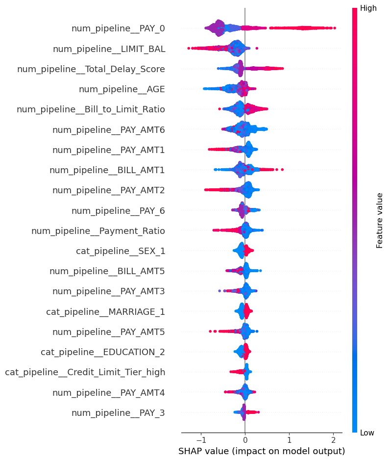

# Loan Default Risk Prediction

## Business Problem
A digital lender needs to decide, per applicant, whether to approve or
reject a credit line — balancing default losses against lost approval
revenue — with an explainable decision for regulatory/fair-lending purposes.

## Headline Result
At a **0.25 probability threshold**, expected portfolio profit is
maximized at **$154,800** (on illustrative assumptions: $4,000 loss per
missed default, $400 profit per correctly approved applicant), compared
to a lower expected profit at the naive 0.5 cutoff.

## Model Performance
- PR-AUC (Precision-Recall AUC): **0.5439** — roughly 2.4x better than the
  random-guess baseline of ~0.221 (the dataset's actual default rate)
- Metric chosen over accuracy/ROC-AUC because the positive class (default)
  is a minority class (~22.1%), where accuracy is misleading

## Dataset
UCI "Default of Credit Card Clients" — 30,000 rows, 23 features, Taiwan
credit card clients. No true NaNs; invalid category codes found in
EDUCATION (0, 5, 6) and MARRIAGE (0), recoded to 'other' rather than
dropped (preserves ~300+ rows that would otherwise be discarded).

## Tech Stack
SQL (SQLite, aggregation feature engineering) · Python/Pandas ·
Scikit-learn · XGBoost · imbalanced-learn (SMOTE) · SHAP · FastAPI

## Architecture
'''
loan-default-risk/
├── src/
│ ├── logger.py, exception.py, utils.py
│ ├── components/ (ingestion, transformation, training, evaluation)
│ └── pipeline/ (train_pipeline, predict_pipeline)
├── app.py (FastAPI serving layer)
├── artifacts/ (generated: model, preprocessor, SHAP plot)
└── config/config.yaml
'''

## How to Run

pip install -r requirements.txt
python -m src.pipeline.train_pipeline
uvicorn app:app --reload

Visit `http://127.0.0.1:8000/docs` to test the `/predict` endpoint.

## Explainability

Top drivers: `PAY_0` (most recent repayment status) dominates, followed
by `LIMIT_BAL` (credit limit) and the engineered `Total_Delay_Score`
(cumulative repayment delay across 6 months). Demographic features
(SEX, MARRIAGE, EDUCATION) rank lowest — the model leans on behavioral
and financial signals rather than demographic proxies.

## Key Design Decisions
- **Stratified train/test split** — preserves the ~22.1% default ratio
  in both splits
- **SQL-based aggregation** (Total_Delay_Score, Credit_Limit_Tier) — done
  in SQLite rather than pandas, simulating a warehouse feature-engineering
  layer
- **Invalid-category recoding over row-dropping** — EDUCATION/MARRIAGE
  garbage codes kept as 'other' rather than discarded
- **PR-AUC over accuracy** — accuracy is misleading at ~22% positive class
- **SMOTE applied only on the training set, post-split** — avoids
  synthetic-sample leakage into the test set
- **SHAP for global explainability** — required for a fair-lending style
  justification of approve/reject decisions
- **Expected-profit threshold curve, not F1** — converts the model's
  probability output into an actual business decision at $154,800
  projected value, not just a classification score
